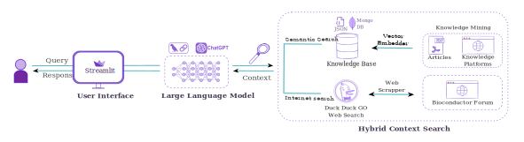

<p align="center">
  
</p>

<p align="center">
  <em>🚀 Try <a href="https://limma-bot-cravd3dyaqhkegf8.eastus-01.azurewebsites.net/"> limmaGenie</a></em>
</p>

# 🧞‍♀️ live demo

**Your AI-powered assistant for differential expression analysis using the [limma](https://bioconductor.org/packages/release/bioc/html/limma.html) package.**

Try it here here:
<div style="position:relative; padding-bottom:56.25%; height:0; overflow:hidden; border:2px solid #333; border-radius:8px;">
  <iframe src="https://limma-bot-cravd3dyaqhkegf8.eastus-01.azurewebsites.net/" 
          frameborder="0" width="100%" height="100%" 
          allowfullscreen style="position:absolute; top:0; left:0; border:2px solid #555; border-radius:8px;">
  </iframe>
</div>

## 📌 About Us

**limmaGenie** is a web-based assistant built to help researchers perform **differential expression analysis** using `limma`. Whether you're new to bioinformatics or an experienced researcher, limmaGenie provides step-by-step guidance to:

- Design your experiment
- Generate R code using `limma`
- Understand and interpret outputs across RNA-seq, microarrays, and other omics data

Built with **LLM-powered intelligence** and deployed as a lightweight app, it's designed to **democratize omics analysis**.

## ⚙️ How it works
<div style="width: 100%; margin: 0 auto; background-color: #f9f9f9;;">
  
</div>

## 🛠️ How to Install

1. **Clone the Repository:**

   ```bash
   git clone https://github.com/your-username/limmaGenie.git
   cd limmaGenie
   ```

2. **Create Virtual Environment:**

   ```bash
   python -m venv .venv
   source .venv/bin/activate  # or venv\Scripts\activate on Windows
   ```

3. **Install Dependencies:**

   ```bash
   pip install -r requirements.txt
   ```

4. **Run the App:**
   ```bash
   streamlit run app.py
   ```


## 🧠 What Tech Stack?

- **Frontend & UI**: [Streamlit](https://streamlit.io/)
- **Backend Logic**: Python + Flask + LangChain
- **LLM Integration**: OpenAI + LangChain + Prompt Engineering
- **Knowledge Curation**: Unstructured + BeautifulSoup
- **Search Integration**: DuckDuckGo + BeautifulSoup
- **Database**: MongoDB (secure access required)


## 🔐 To Get DB Access

To get access to the database for full functionality, please email:

📧 **bkushagra100@gmail.com**
📧 **sudiptakh037@gmail.com**


## 📦 requirements.txt

Install required libraries using:

```bash
pip install -r requirements.txt
```


## 📘 Citations & Learning Resources

Learn more about `limma` and associated tools here:

- [limma User's Guide (Bioconductor)](https://bioconductor.org/packages/release/bioc/vignettes/limma/inst/doc/usersguide.pdf)
- [Design Matrix Guide for Gene Expression](https://bioconductor.org/help/workflows/limmaWorkflows/)
- [RNA-seq Analysis with limma, Glimma, and edgeR](https://f1000research.com/articles/5-1408)


## 👨‍🔬 Built By

- **Sudipta Kumar Hazra** – MSc (Research) Student, UCC and Teagasc, Ireland
- **Kushagra Bhatnagar** – Machine Learning Scientist

We're committed to building smarter and simpler tools for the omics research community.


## 💬 Thanks for Visiting!

If you find this useful, ⭐ star the repo and feel free to contribute!
